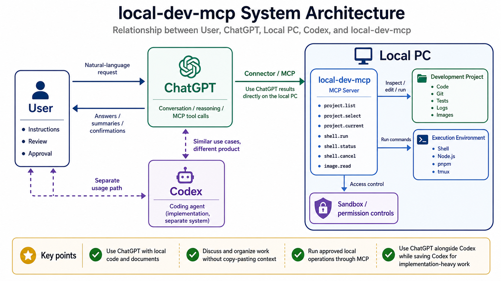

# local-dev-mcp

日本語版: [README_ja.md](README_ja.md)

Local MCP server for letting ChatGPT operate selected local development projects through MCP tools.

The server is designed around a project registry. Only registered project roots are accessible, and each project can define denied paths such as `.env`, `.ssh`, `secrets`, and `credentials`.

The intended workflow is:

1. A local developer runs this server on their machine.
2. ChatGPT connects to the server through MCP, usually through the HTTP transport and a controlled HTTPS tunnel.
3. ChatGPT can inspect and operate only the projects listed in the local project registry.

Codex, Claude Code, and similar coding agents are useful for setting up this repository on the user's machine. They are not the primary runtime client this project was built for.



## Intended Uses

- Let ChatGPT inspect local code, logs, test output, and project documents without copy-pasting large context into the chat.
- Discuss architecture, implementation plans, bugs, and refactors in ChatGPT using the actual local repository as context.
- Run selected local commands from ChatGPT when the user approves the operation.
- Use ChatGPT alongside Codex or Claude Code: Codex can keep doing direct coding work, while ChatGPT can discuss and inspect local state through this MCP server.
- Save Codex usage for implementation-heavy work by using ChatGPT for local-code-aware discussion, review, and lightweight operations.

## Security Model

This project exposes local development tools to ChatGPT. Treat it as local-machine access infrastructure, not as a public web app.

Recommended deployment:

- Run the MCP server on `127.0.0.1`.
- Expose it only through a tightly controlled HTTPS tunnel when ChatGPT needs remote access.
- Register only the project directories you actually want ChatGPT to access.
- Keep `.env`, `.ssh`, credentials, secrets, build outputs, logs, and local-only config out of git and in `denied_paths` where appropriate.

The server provides defense-in-depth, but it is not a hard OS sandbox. The current sandbox type is `host`, so shell commands run on the local machine with the permissions of the user account running this server. Keep the server bound to localhost and use tunnel-side access controls.

Safety controls included in this repo:

- Project registry allowlist: ChatGPT must select from configured projects.
- Workspace file tools reject paths outside the selected project root.
- `denied_paths` blocks configured secret paths for workspace tools and forbidden shell classifications.
- HTTP Host / `X-Forwarded-Host` allowlist can restrict requests to localhost and configured tunnel hosts when `LOCAL_DEV_MCP_PUBLIC_ORIGIN` or `LOCAL_DEV_MCP_ALLOWED_HOSTS` is set.
- Shell risk classification separates read-only, local compute, workspace write, network/dependency, destructive/process-control, and forbidden operations.
- `forbidden` shell commands are blocked, including common secret reads and catastrophic system operations.
- Shell output is redacted for common token, key, and credential patterns before being returned.
- HTTP MCP access uses OAuth bearer tokens. The authorization endpoint is protected by a passphrase.
- The server listens on `127.0.0.1`; external access should be provided by a controlled HTTPS tunnel.

Important limitations:

- A determined command can still be dangerous if the user approves it. Review shell commands before approving.
- Static risk classification is conservative but not perfect.
- This does not replace OS-level sandboxing, container isolation, filesystem permissions, or network ACLs.
- Do not expose the HTTP endpoint directly to the public internet.

## ChatGPT Approvals

ChatGPT may show frequent confirmation or approval prompts when using MCP tools, especially for local file access, command execution, network/dependency commands, writes, and destructive operations. That is expected and intentional. The prompts are part of ChatGPT's safety model and should be treated as a review point, not as a bug.

For this project, the recommended default is:

- `approval_mode: policy`
- `write_policy: confirm`
- `network_policy: ask`

This means routine reads can stay smooth, while writes and network/dependency operations usually ask for confirmation.

## Features

- Project selection from a YAML registry
- Workspace read, list, search, and patch tools
- Skills discovery and read tools for ChatGPT (`skills.list`, then `skills.read`)
- Shell command execution with risk classification and approval flow
- Git diff/status helpers
- Browser, mobile simulator, and image read helpers
- OAuth-protected HTTP transport for ChatGPT Apps style clients

## Setup

### Agent Quick Setup For ChatGPT Local Access

If you are Codex, Claude Code, or another coding agent and the user says "set this up for ChatGPT", follow this checklist. The goal is to prepare this local MCP server so ChatGPT can connect to it and operate the user's selected local project roots.

1. Confirm prerequisites:

   ```bash
   node --version
   pnpm --version
   ```

   Use Node.js 22 or newer. If `pnpm` is missing, enable it with Corepack when available:

   ```bash
   corepack enable
   corepack prepare pnpm@latest --activate
   ```

2. Install dependencies:

   ```bash
   pnpm install
   ```

3. Create local-only config files if they do not already exist:

   ```bash
   test -f .env || cp .env.example .env
   test -f config/projects.local.yaml || cp config/projects.yaml config/projects.local.yaml
   ```

4. Set an OAuth authorization passphrase in `.env`.

   ```bash
   node -e "console.log(require('crypto').randomBytes(24).toString('base64url'))"
   ```

   Put the generated value in:

   ```bash
   LOCAL_DEV_MCP_PASSPHRASE=...
   ```

   Do not print the final `.env` contents back to the user.

5. Edit `config/projects.local.yaml` for the user's machine.

   Replace `/absolute/path/to/your/project` with the absolute path of the project the user wants ChatGPT to operate. If the user did not name a project, ask for the project path before editing. Keep secret-bearing paths in `denied_paths`.

   A minimal single-project entry looks like this:

   ```yaml
   projects:
     my-project:
       display_name: My Project
       host_root: /absolute/path/to/my-project
       sandbox_root: /absolute/path/to/my-project
       sandbox_type: host
       default_shell: /bin/bash
       default_timeout_seconds: 30
       max_timeout_seconds: 300
       network_policy: ask
       write_policy: confirm
       approval_mode: policy
       denied_paths:
         - .env
         - .env.*
         - .npmrc
         - .ssh
         - secrets
         - credentials
       redaction_profile: default
   ```

6. Validate the setup:

   ```bash
   pnpm run doctor -- config/projects.local.yaml
   pnpm typecheck
   pnpm test
   ```

7. Start the local HTTP server:

   ```bash
   pnpm dev:http -- config/projects.local.yaml
   ```

   Then verify it responds:

   ```bash
   curl -sS http://127.0.0.1:3456/
   ```

   Expected response:

   ```text
   local-dev-mcp MCP server running.
   ```

8. If the user wants ChatGPT to connect from outside the machine, configure a controlled HTTPS tunnel.

   Do not expose the HTTP endpoint directly to the public internet. This repo includes `scripts/tunnel.sh` for Cloudflare Tunnel. It requires these `.env` values:

   ```bash
   LOCAL_DEV_MCP_PUBLIC_ORIGIN=https://your-tunnel.example.com
   LOCAL_DEV_MCP_ALLOWED_HOSTS=your-tunnel.example.com
   LOCAL_DEV_MCP_CLOUDFLARE_TUNNEL_ID=your-tunnel-id
   LOCAL_DEV_MCP_CLOUDFLARE_CREDENTIALS_FILE=/absolute/path/to/credentials.json
   LOCAL_DEV_MCP_PROJECTS_CONFIG=/absolute/path/to/local-dev-mcp/config/projects.local.yaml
   ```

   If those values are not already available, stop and ask the user for the tunnel details or ask whether they want only local HTTP setup for now. Do not invent tunnel IDs, hostnames, or credential paths.

9. Give the user the ChatGPT connection target:

   - Local HTTP endpoint for local testing: `http://127.0.0.1:3456/mcp`
   - ChatGPT-reachable tunnel endpoint: `${LOCAL_DEV_MCP_PUBLIC_ORIGIN}/mcp`

   ChatGPT should use the HTTP MCP endpoint that is reachable from the ChatGPT connector flow. Stdio is mainly useful for local MCP clients and debugging.

10. Tell the user to add the app in ChatGPT Developer Mode.

   Codex, Claude Code, and other local coding agents cannot complete this step inside the user's ChatGPT account. Give the user the endpoint from step 9 and ask them to follow [ChatGPT Developer mode](https://developers.openai.com/api/docs/guides/developer-mode) and [Developer mode and MCP apps in ChatGPT](https://help.openai.com/en/articles/12584461-developer-mode-and-mcp-apps-in-chatgpt).

   User-facing steps:

   1. Open ChatGPT on the web.
   2. Enable Developer Mode. Depending on the workspace plan and permissions, this is under Settings -> Apps -> Advanced settings -> Developer mode, or Workspace settings -> Apps / Permissions & Roles.
   3. Open Apps settings and choose Create app.
   4. Enter the ChatGPT-reachable MCP endpoint, for example `${LOCAL_DEV_MCP_PUBLIC_ORIGIN}/mcp`.
   5. Choose OAuth authentication.
   6. Click Scan Tools.
   7. When the authorization page opens, enter the `LOCAL_DEV_MCP_PASSPHRASE` value from `.env`.
   8. Wait for the tool scan to finish, then click Create.
   9. Open a new chat and select the draft app from the tools / plus menu or Developer Mode tool picker.
   10. Test with a read-only prompt first, such as "Use local-dev-mcp to list projects."

   Notes for the user:

   - ChatGPT must be able to reach the MCP endpoint. `127.0.0.1` is only for local testing; use a controlled ChatGPT-reachable tunnel endpoint for ChatGPT.
   - Developer Mode and full MCP write/modify support depend on the user's ChatGPT plan, workspace settings, and admin permissions.
   - ChatGPT may ask for confirmation frequently. Review the tool payload before approving write or command execution.

11. Report back with:

   - The absolute path of `config/projects.local.yaml`
   - The selected project IDs
   - Whether `pnpm typecheck` and `pnpm test` passed
   - Whether only local HTTP is ready or the public tunnel is also ready
   - The ChatGPT MCP endpoint to use
   - That the remaining ChatGPT Developer Mode app creation step must be completed by the user

Do not commit or print the contents of `.env`, `.local-dev-mcp`, `logs`, `generated`, `dist`, `node_modules`, or `config/projects.local.yaml`.

## Skills access for ChatGPT

ChatGPT does not automatically load Codex/Haru `SKILL.md` files. Use:

1. `skills.list` with an optional registered project `path`.
2. `skills.read` with the exact `SKILL.md` path returned by `skills.list`.

`skills.list` includes project-local `<path>/.agents/skills`, common `${HARU_CONTEXT_HOME:-~/.haru}/skills`, and system `${CODEX_HOME:-~/.haru/.codex}/skills/.system`.

For local debugging or non-ChatGPT MCP clients, these connection forms are available:

- Stdio command:

  ```bash
  pnpm dev -- /absolute/path/to/local-dev-mcp/config/projects.local.yaml
  ```

- Local HTTP endpoint after starting the server:

  ```text
  http://127.0.0.1:3456/mcp
  ```

Use the MCP client's native configuration mechanism to register either the stdio command or the HTTP endpoint. Do not hard-code another user's local paths.

## Add The App In ChatGPT Developer Mode

This part must be done by the user in ChatGPT. A local coding agent can prepare the server and provide the endpoint, but it cannot click through the user's ChatGPT workspace settings or approve the app on their behalf.

Prerequisites:

- ChatGPT web access with Developer Mode available for the account/workspace.
- A ChatGPT-reachable MCP endpoint, usually `${LOCAL_DEV_MCP_PUBLIC_ORIGIN}/mcp`.
- `LOCAL_DEV_MCP_PASSPHRASE` set in the local `.env`.

Steps:

1. Open ChatGPT on the web.
2. Enable Developer Mode:
   - User settings path: Settings -> Apps -> Advanced settings -> Developer mode.
   - Workspace/admin path: Workspace settings -> Apps, or Workspace settings -> Permissions & Roles, depending on plan and permissions.
3. Open Apps settings and click Create app.
4. Enter the MCP endpoint, for example:

   ```text
   https://your-trusted-endpoint.example.com/mcp
   ```

5. Choose OAuth authentication.
6. Click Scan Tools.
7. Complete the authorization prompt by entering your `LOCAL_DEV_MCP_PASSPHRASE`.
8. After the tool scan completes, click Create.
9. Confirm the app appears as a draft / developer app.
10. Start a new chat and select the app from the tools / plus menu or Developer Mode tool picker.
11. Test with read-only prompts first:

   ```text
   Use local-dev-mcp to list projects.
   ```

   ```text
   Use local-dev-mcp to select my project, then show the current project.
   ```

Write and command execution prompts can trigger ChatGPT confirmation dialogs. Review the JSON payload before approving. If ChatGPT cannot connect, verify the endpoint is reachable from ChatGPT, OAuth discovery works, the passphrase is correct, and the server logs show the request.

Official references:

- [ChatGPT Developer mode](https://developers.openai.com/api/docs/guides/developer-mode)
- [Developer mode and MCP apps in ChatGPT](https://help.openai.com/en/articles/12584461-developer-mode-and-mcp-apps-in-chatgpt)

### Manual Setup

```bash
pnpm install
cp .env.example .env
cp config/projects.yaml config/projects.local.yaml
```

Set `LOCAL_DEV_MCP_PASSPHRASE` in `.env` before using the OAuth authorization flow:

```bash
node -e "console.log(require('crypto').randomBytes(24).toString('base64url'))"
```

Edit `config/projects.local.yaml` so every `host_root` and `sandbox_root` points to a local project you want to expose.

Run the setup doctor:

```bash
pnpm run doctor -- config/projects.local.yaml
```

Run the HTTP server:

```bash
pnpm dev:http -- config/projects.local.yaml
```

Run with stdio transport:

```bash
pnpm dev -- config/projects.local.yaml
```

## Project Registry

`config/projects.yaml` is a safe example file. Keep local machine paths in `config/projects.local.yaml`, which is ignored by git.

Each project entry supports:

- `display_name`
- `host_root`
- `sandbox_root`
- `sandbox_type`
- `default_shell`
- `default_timeout_seconds`
- `max_timeout_seconds`
- `network_policy`
- `write_policy`
- `approval_mode`
- `denied_paths`
- `redaction_profile`

## Cloudflare Tunnel

`scripts/tunnel.sh` can start the HTTP server and a Cloudflare Tunnel. Use this only when the tunnel is part of your controlled access path. Do not expose the local MCP server directly.

Configure these values in `.env` first:

```bash
LOCAL_DEV_MCP_PUBLIC_ORIGIN=https://your-tunnel.example.com
LOCAL_DEV_MCP_ALLOWED_HOSTS=your-tunnel.example.com
LOCAL_DEV_MCP_CLOUDFLARE_TUNNEL_ID=your-tunnel-id
LOCAL_DEV_MCP_CLOUDFLARE_CREDENTIALS_FILE=/absolute/path/to/credentials.json
LOCAL_DEV_MCP_PROJECTS_CONFIG=/absolute/path/to/config/projects.local.yaml
```

`LOCAL_DEV_MCP_PUBLIC_ORIGIN` is automatically added to the HTTP host allowlist. Use `LOCAL_DEV_MCP_ALLOWED_HOSTS` only for additional trusted proxy hostnames.

Then run:

```bash
pnpm tunnel
```

## Safety Notes

- Do not commit `.env`, `.local-dev-mcp`, `logs`, `generated`, or `config/projects.local.yaml`.
- Keep secrets out of registered projects or add their paths to `denied_paths`.
- Review command approvals carefully before allowing write or destructive operations.

## Development

```bash
pnpm run doctor -- config/projects.local.yaml
pnpm typecheck
pnpm test
```
