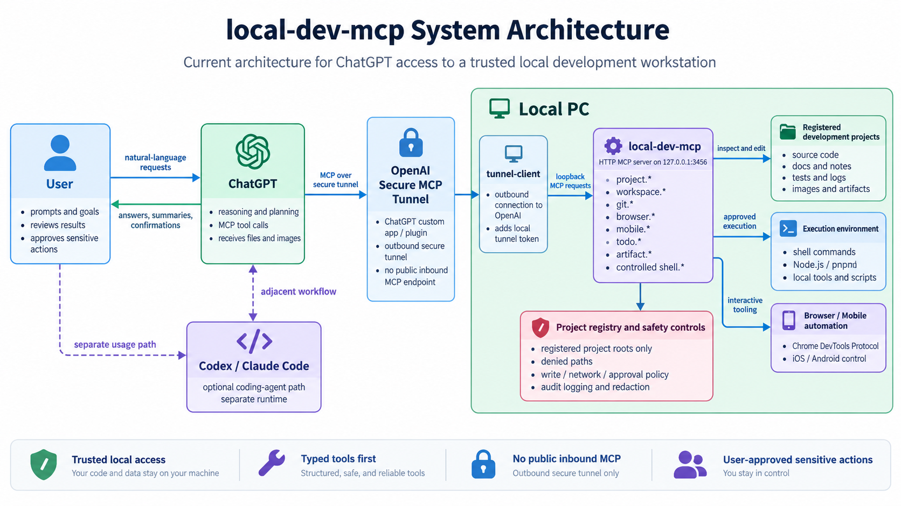

# local-dev-mcp



`local-dev-mcp` is a private MCP server for operating a trusted development workstation from ChatGPT. It exposes registered projects through typed project, workspace, git, browser, mobile, Todo, artifact, and controlled shell tools.

For ChatGPT, the canonical transport is **OpenAI Secure MCP Tunnel**. The HTTP MCP server listens on loopback only and does not expose a public MCP endpoint.

## Intended Uses

- inspect and edit source repositories
- run tests, builds, deploy commands, and custom scripts
- operate browser sessions and mobile devices
- inspect images through MCP inline image content
- transfer generated files from the development host to ChatGPT
- receive normal ChatGPT attachments into a selected project
- keep per-conversation project selection and audit records

## Security Model

The main boundary is the project registry. Only registered project roots are addressable.

Each project can define:

- host and sandbox roots
- denied paths
- write policy
- approval mode
- network policy
- default and maximum command timeouts
- redaction profile

Important runtime rules:

- HTTP MCP binds to `127.0.0.1` only.
- HTTP requests accept loopback `Host` values only.
- HTTP MCP requires `X-Local-Dev-MCP-Tunnel-Token` on every protected request.
- HTTP tool calls and resource reads also require the ChatGPT `openai/subject` to match the local allowlist.
- The local tunnel token is shared only between `tunnel-client` and `local-dev-mcp`.
- The OpenAI Tunnel runtime API key and local tunnel token are never embedded in launchd plist files.
- `shell.run` remains the fallback escape hatch; prefer typed tools whenever possible.
- denied-path checks apply to file reads, writes, artifact transfer, and project-scoped operations.
- raw artifact bytes and temporary file download URLs are not written to normal audit logs.

The stdio transport remains available for local MCP clients. The Secure Tunnel token is required only for the HTTP transport.

## ChatGPT Approvals

ChatGPT may show confirmation UI before write or command-execution tools. Review the target project and arguments before approval.

The MCP server also enforces its own project policy and shell-risk policy. ChatGPT approval is not treated as the only safety boundary.

## Features

Core tool families include:

- `project.*` — select, inspect, and reload registered projects
- `workspace.*` — bounded file listing, reading, searching, and patching
- `git.*` — structured repository status, diff, history, and commit inspection
- `shell.*` — managed shell execution, approvals, background jobs, and cancellation
- `browser.*` — Chrome DevTools Protocol browser automation
- `mobile.*` — iOS/Android inspection and interaction
- `todo.*` — shared Todo Service operations
- `skills.*` — readable project/user/system Skills
- `image.read` — inline image inspection without a custom viewer or public URL
- `artifact.link` — send a lightweight MCP resource link to a local file without embedding file bytes in tool history
- `artifact.read` — compatibility fallback that embeds a local file directly in the MCP tool result
- `artifact.receive` — receive a normal ChatGPT attachment in one MCP call
- `tool.schema` / `tool.usage` — schema refresh and compact usage diagnostics

## Efficient Tool Usage And Diagnostics

Prefer typed tools over broad shell commands:

- use `project.inspect` rather than filesystem discovery for the active project
- use bounded `workspace.read`, `workspace.list`, and `workspace.search` rather than large shell scans
- use typed `git.*` tools for common repository inspection
- use `shell.run` for builds, tests, deploys, installs, and unsupported operations
- use `shell.run` with `async=true` for work that may exceed roughly 30 seconds, then poll `shell.status`
- use `tool.schema` after server/tool changes when ChatGPT has stale action metadata

## Browser Profiles

Browser state is isolated by the ChatGPT `openai/session` identity. The same chat
keeps one profile across project changes; different chats never share a running
profile. Browser tools fail explicitly when a chat session identity is unavailable.

The first browser use in a chat copies the current immutable golden generation.
On `browser.stop`, allowlisted live probes verify the signed-in account, the stopped
profile is snapshotted, and a separate Chrome clone must pass the same probes before
the snapshot can become golden. The current and previous golden generations are
retained. Idle chat profiles that have not been used for 24 hours are removed.

Running managed browsers use a separate inactivity deadline. After 30 minutes
without a browser tool call, the server runs the same live auth probe,
checkpoint, and golden-promotion pipeline as `browser.stop`, then terminates
Chrome. Set `LOCAL_DEV_MCP_BROWSER_IDLE_TIMEOUT_MINUTES` to a positive value up
to 1440 to change this deadline. Server startup reconciles stale managed leases,
and SIGINT/SIGTERM drains managed browsers through the same stop pipeline. These
rules apply only to chat-owned profiles in the browser manifest; the legacy
shared browser is not automatically terminated.

Use `browser.tabs` to inspect the current tab set. `browser.tab.open` creates
and selects a tab, `browser.tab.use` selects an existing target ID, and
`browser.tab.close` closes one explicitly. DOM, click, type, screenshot, and
navigation operations always use that selected target and fail visibly when
no active tab is selected.

The default probe configuration is `config/browser-auth-probes.yaml`. Probe results
store only hashed principals and status metadata; cookies, DOM content, and account
labels are not written to MCP results or manifests. A legacy shared `default` profile
is imported only while its Chrome process is stopped.

## Requirements

- Node.js 22 or newer
- pnpm through Corepack or a compatible pnpm installation
- macOS for the supplied launchd workflow
- OpenAI `tunnel-client` for ChatGPT connectivity
- optional platform-specific tools for browser/mobile workflows

## Setup

Install dependencies:

```bash
pnpm install
pnpm typecheck
pnpm test
```

Configure the local project registry. A workstation normally uses `config/projects.local.yaml`; otherwise `config/projects.yaml` is used.

Run the local diagnostic command:

```bash
pnpm doctor
```

Start the stdio MCP transport for a local MCP client:

```bash
pnpm dev
```

## OpenAI Secure MCP Tunnel

### Architecture

```text
ChatGPT Web / Mobile
        │
        │ custom plugin
        ▼
OpenAI Secure MCP Tunnel
        │
        ▼
tunnel-client
        │  X-Local-Dev-MCP-Tunnel-Token
        ▼
127.0.0.1:3456/mcp
        │
        ▼
local-dev-mcp
```

No public MCP hostname, reverse proxy, or inbound firewall rule is required.

### Install tunnel-client

Install the latest official release with checksum verification:

```bash
pnpm tunnel:install
```

The default binary link is:

```text
~/.local-dev-mcp/bin/tunnel-client
```

Set `LOCAL_DEV_MCP_TUNNEL_CLIENT_VERSION` only when a release must be pinned explicitly.

### Private state

Tunnel state is split by ChatGPT context. Personal and Business Tunnel clients can point at the same loopback MCP server while keeping their OpenAI control-plane state separate:

```text
~/.local-dev-mcp/openai-tunnel-personal/
├─ organization-id
└─ tunnel-id

~/.local-dev-mcp/openai-tunnel-business/
├─ organization-id
└─ tunnel-id

~/.openai-tunnels/personal/runtime-api-key
~/.openai-tunnels/business/runtime-api-key

~/.local-dev-mcp/openai-tunnel/mcp-token
~/.local-dev-mcp/allowed-openai-subject  # optional
```

- `organization-id` is the OpenAI organization that owns that Tunnel.
- `tunnel-id` is the Tunnel ID created in OpenAI Platform.
- each `runtime-api-key` belongs to its corresponding Personal or Business control-plane context.
- `mcp-token` is a shared local-hop secret used only between the Tunnel clients and `local-dev-mcp`. It is intentionally not duplicated per Tunnel.
- `allowed-openai-subject` is optional. When present, it enables a single-user `openai/subject` allowlist for HTTP tools and resources. Other subjects fail closed; anonymous requests also fail closed except for the exact ChatGPT Scheduled Task metadata shape documented in [`docs/chatgpt-scheduled-task-mcp-metadata.md`](docs/chatgpt-scheduled-task-mcp-metadata.md). Without subject configuration, the server uses the required Tunnel token only.

Recommended permissions are `0700` for state directories and `0600` for the files they contain. Do not commit these files or paste secret values into logs.

Environment-variable alternatives are supported for automation:

- `LOCAL_DEV_MCP_OPENAI_TUNNEL_ID` / `_FILE`
- `LOCAL_DEV_MCP_OPENAI_TUNNEL_ORGANIZATION_ID` / `_FILE`
- `LOCAL_DEV_MCP_OPENAI_TUNNEL_API_KEY` / `_FILE`
- `LOCAL_DEV_MCP_OPENAI_TUNNEL_TOKEN` / `_FILE`
- `LOCAL_DEV_MCP_ALLOWED_OPENAI_SUBJECT` / `_FILE` (optional; configuring either enables subject enforcement, and the default file `~/.local-dev-mcp/allowed-openai-subject` is auto-detected when present)
- `LOCAL_DEV_MCP_OPENAI_SUBJECT_POLICY` (optional override: `enforce` requires subject configuration; `tunnel_only` disables subject restriction while retaining hashed subject auditing)
- `LOCAL_DEV_MCP_OPENAI_TUNNEL_STATE_DIR`
- `LOCAL_DEV_MCP_TUNNEL_CLIENT_BIN`
- `LOCAL_DEV_MCP_OPENAI_TUNNEL_HEALTH_ADDR`
- `LOCAL_DEV_MCP_OPENAI_TUNNEL_STARTUP_WAIT`
- `LOCAL_DEV_MCP_OPENAI_TUNNEL_LOG_LEVEL`

The direct `scripts/tunnel.sh` defaults are the Personal profile. `scripts/install-launchd.sh` always writes the Personal LaunchAgent and can additionally write the Business LaunchAgent:

```bash
LOCAL_DEV_MCP_OPENAI_TUNNEL_BUSINESS_ENABLE=1 scripts/install-launchd.sh --install-only
```

Default health ports are `127.0.0.1:3460` for Personal and `127.0.0.1:3462` for Business.

### Start and diagnose

Start the loopback HTTP MCP server:

```bash
pnpm server:http
```

With the server running, validate the Tunnel configuration and MCP probe:

```bash
pnpm tunnel:doctor
```

Start the Tunnel client:

```bash
pnpm tunnel
```

By default:

- MCP server: `127.0.0.1:3456`
- tunnel-client health/readiness: `127.0.0.1:3460`

A healthy setup should report the local MCP probe as reachable and Tunnel readiness as `ready`.

HTTP tool and resource authorization writes a privacy-safe audit event to
`logs/audit.jsonl`. The event records `openAiSubjectHash` as
`sha256:<64 lowercase hex characters>` plus `openAiSubjectPresent` and
`openAiSubjectAuthorized`; it never stores the raw subject. Count distinct
authorized subjects in a half-open observation window with:

```bash
pnpm audit:subject-count -- \
  --since 2026-09-17T00:00:00Z \
  --until 2026-09-18T00:00:00Z
```

Pass `--log <path>` more than once when a window spans rotated audit files.

### launchd

Write the canonical LaunchAgents without activating them:

```bash
pnpm launchd:install
```

Activate them:

```bash
pnpm launchd:activate
```

Activation is handed off to a short-lived launchd worker before the managed server and Tunnel jobs are restarted. This makes the command safe to invoke through `local-dev-mcp` itself; the MCP connection may briefly disconnect while the worker restarts the services. Activation diagnostics are written to `logs/launchd-activate.log` and `logs/launchd-activate-error.log`.

The default jobs are:

```text
io.local-dev-mcp.server
io.local-dev-mcp.openai-tunnel-personal
```

When `LOCAL_DEV_MCP_OPENAI_TUNNEL_BUSINESS_ENABLE=1` is set during install, `io.local-dev-mcp.openai-tunnel-business` is added. Legacy `io.local-dev-mcp.openai-tunnel` and `io.local-dev-mcp.openai-tunnel-personal-mini` jobs are retired and removed during `--activate`.

The server and Tunnel clients are separate processes, so Tunnel reconnects do not restart the MCP server.

## Add The Plugin In ChatGPT Developer Mode

1. Create the Tunnel in OpenAI Platform.
2. Associate it with the intended ChatGPT account/workspace when the Platform UI requires an association.
3. Start `local-dev-mcp` and `tunnel-client` and confirm Tunnel readiness.
4. Open ChatGPT Developer Mode / Plugins.
5. Create a custom plugin using **Tunnel** as the connection type.
6. Select or enter the Tunnel ID.
7. Use no additional plugin authentication; the private local hop is already protected by the Tunnel token.
8. After a tool-schema change, update the ChatGPT-side snapshot according to scope. USER-scoped Plugins use the normal Refresh flow. For this Business workspace, first refresh the existing published app's actions in place, then read back the actions from a Branch/new chat. See `docs/chatgpt-user-plugin-schema-refresh.md` and `docs/chatgpt-business-app-schema-refresh.md`.

As of 2026-09-20, OpenAI's Help Center still says Business published apps must be recreated and republished for tool/metadata changes, while this workspace has directly accepted an in-place action refresh. Do not make recreation the default here; use it only when refresh is unavailable or fails.

This repository has been end-to-end tested with a Pro developer-mode plugin on both ChatGPT Web and Android Mobile.

## Bidirectional File Transfer

### Development host → ChatGPT

Use `artifact.link` by default when the user needs the actual file:

```text
local file
  → artifact.link
  → MCP ResourceLink (`local-dev-artifact://...`)
  → Secure MCP Tunnel
  → client fetches the original through `resources/read` only when needed
```

`artifact.link` returns only metadata plus the resource URI in the tool result, so large base64 payloads do not accumulate in normal tool-call history. The original file is resolved through MCP `resources/read` when the client chooses to fetch it.

`artifact.read` remains as a compatibility fallback for clients or flows that explicitly require an embedded resource. It base64-embeds the file directly in the tool result and is limited to 6 MiB raw file size per call so the encoded MCP response stays below the Secure Tunnel payload limit. `artifact.link` uses the same 6 MiB raw-file safety limit because the linked resource is later fetched through `resources/read`.

Use `workspace.read` for text inspection and try `image.read` first for image inspection when the user does not need the file itself. Avoid preemptive `artifact.link`/materialization because it adds a transfer step and may introduce approval prompts. Fall back to resource materialization for `preview_unavailable` or a client-side inline-image transport failure only when the source fits the 6 MiB materialization limit. If `image.read` returns `IMAGE_TOO_LARGE`, create or request a smaller local preview instead of sending the oversized original through the Secure Tunnel.

### ChatGPT → development host

`artifact.receive` declares:

```text
_meta["openai/fileParams"] = ["file"]
```

A normal ChatGPT attachment is converted by the ChatGPT host into a temporary authorized file reference containing:

```text
download_url
file_id
mime_type?
file_name?
```

`artifact.receive` downloads and saves it in the **same MCP tool call**. No base64 chunk loop is needed.

Default destination behavior:

- unique file under `generated/uploads/`
- optional explicit project-relative `destination`
- existing files are never overwritten

Receive-side protections include:

- HTTPS-only source URLs
- rejection of loopback/local-network destinations resolved from the source URL
- redirect target revalidation
- project-root and denied-path enforcement
- no symlink traversal in destination parents
- streaming SHA-256 calculation
- 512 MiB hard receive limit; `LOCAL_DEV_MCP_ARTIFACT_RECEIVE_MAX_BYTES` can reduce it
- temporary download URL omitted from audit logs

The normal-attachment flow has been end-to-end verified on ChatGPT Web and Android Mobile with byte count and SHA-256 matching the original.

## Image Handling

`image.read` is the preferred first path for model-only project-image inspection. It returns model-visible MCP `ImageContent` plus metadata without first turning the image into a user-facing attachment or materialized file. Source images above 8 MiB are currently rejected before preview generation. For accepted sources, default `preview` mode keeps the original inline only when it is at most 512 KiB and within the requested edge limit (900 px by default); otherwise supported PNG/JPEG/WebP images are downscaled to a JPEG preview. Explicit `full` mode is capped at 6 MiB raw image size to keep the encoded response below the Secure Tunnel payload limit. If preview creation is unavailable, the result can contain metadata without inline ImageContent. It does not create an HTTP image cache, public URL, or custom ChatGPT viewer.

Modes:

- `preview` — default; large supported images are downscaled when possible
- `full` — return the original image inline
- `metadata` — return metadata without inline bytes

If the user needs the image as a downloadable file, use `artifact.link` by default and `artifact.read` only as an embedded-resource fallback.

## Project Registry

Register only roots that ChatGPT should be allowed to operate.

A project entry controls at least:

- `project_id`
- display name
- host/sandbox roots
- shell and timeout settings
- network/write/approval policy
- denied paths
- redaction profile

Per-conversation project selection is stored through `project.select`. Use `project.current` before a project-sensitive operation when context is uncertain.

## Physical Mobile Automation

Mobile tools support discovered iOS and Android targets. Physical-device capabilities depend on the local platform toolchain and device state.

On macOS, `pnpm doctor` checks the project-local `agent-device` installation and reports the physical iOS Developer Tools Security state.

## Safety Notes

- keep private state outside registered project roots
- keep generated or local secret material out of Git
- use restrictive file permissions for Tunnel state
- keep denied-path rules current for every registered project
- review ChatGPT write confirmations
- prefer typed tools to arbitrary shell execution
- do not expose the loopback HTTP MCP server through a separate public ingress

## Development

Run the full local checks before committing:

```bash
pnpm typecheck
pnpm test
bash -n scripts/server.sh scripts/tunnel.sh scripts/install-launchd.sh scripts/install-openai-tunnel-client.sh
```

After changing the tool surface, increment `TOOL_SCHEMA_VERSION` and follow the scope-specific ChatGPT schema update workflow. For this Business workspace, prefer the existing-app action refresh documented in `docs/chatgpt-business-app-schema-refresh.md`; recreation is a fallback.
