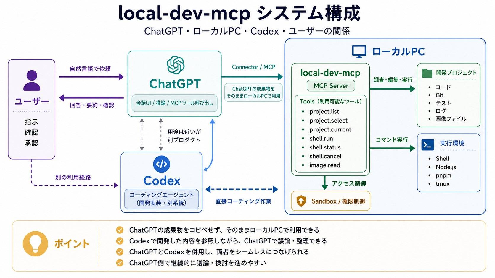

# local-dev-mcp

English: [README.md](README.md)

ChatGPT から、選択したローカル開発プロジェクトを MCP tools 経由で操作するためのローカル MCP server です。

この server は project registry を中心に動きます。ChatGPT がアクセスできるのは登録済みの project root だけで、各 project ごとに `.env`、`.ssh`、`secrets`、`credentials` などの denied path を指定できます。

想定している流れ:

1. ローカル PC 上でこの server を起動する。
2. ChatGPT が HTTP transport と controlled HTTPS tunnel 経由で MCP server に接続する。
3. ChatGPT は local project registry に登録された project だけを調査・操作する。

Codex、Claude Code などの coding agent は、この repo をユーザーのマシンへセットアップする用途に向いています。この project の主な runtime client は ChatGPT です。



## 主な用途

- ChatGPT で、ローカルのコード、ログ、テスト結果、project document を見ながら議論する。
- 大量の context を手で貼らずに、実際の local repository に基づいて設計・実装方針・不具合・リファクタを相談する。
- ユーザーが承認した範囲で、ChatGPT からローカル command を実行する。
- Codex や Claude Code と併用し、実装作業は coding agent、議論・整理・調査は ChatGPT という形で分担する。
- 実装-heavy な作業に Codex の利用枠を残しつつ、ChatGPT で local-code-aware な相談や軽い操作を行う。

## セキュリティモデル

この project は、ChatGPT へローカル開発環境の操作口を提供します。public web app ではなく、ローカルマシンへのアクセス基盤として扱ってください。

推奨構成:

- MCP server は `127.0.0.1` で起動する。
- ChatGPT から remote access する場合は、厳しく制御された HTTPS tunnel 経由に限定する。
- ChatGPT に触らせたい project directory だけを登録する。
- `.env`、`.ssh`、credential、secret、build output、log、local-only config は git に入れず、必要に応じて `denied_paths` に入れる。

この server は defense-in-depth の安全策を持ちますが、強い OS sandbox ではありません。現在の sandbox type は `host` なので、shell command は server を起動した user account の権限でローカルマシン上に実行されます。server は localhost に bind し、tunnel 側で access control をかけてください。

含まれる安全策:

- Project registry allowlist: ChatGPT は登録済み project から選択する必要があります。
- Workspace file tools は selected project root の外側の path を拒否します。
- `denied_paths` は workspace tools と forbidden shell classification で secret path をブロックします。
- Shell risk classification は read-only、local compute、workspace write、network/dependency、destructive/process-control、forbidden を分けます。
- `forbidden` shell command は approval mode に関係なくブロックされます。代表例は secret read や catastrophic system operation です。
- Shell output は common token / key / credential pattern を redaction してから返します。
- HTTP MCP access は OAuth bearer token を使います。authorization endpoint は passphrase で保護されます。
- server は `127.0.0.1` で listen します。外部接続は controlled HTTPS tunnel で提供してください。

重要な限界:

- ユーザーが危険な command を承認すれば、ローカル環境に影響しえます。承認前に command を確認してください。
- 静的な risk classification は保守的ですが、完全ではありません。
- OS-level sandbox、container isolation、filesystem permission、network ACL の代替ではありません。
- HTTP endpoint を public internet に直接公開しないでください。

## ChatGPT の承認

ChatGPT は MCP tools の利用時に頻繁に確認・承認を求めることがあります。特に local file access、command execution、network/dependency command、write、destructive operation では起きやすいです。これは想定内で、ChatGPT 側の安全設計の一部です。バグではなく review point として扱ってください。

推奨 default:

- `approval_mode: policy`
- `write_policy: confirm`
- `network_policy: ask`

これにより、通常の read は比較的スムーズにしつつ、write や network/dependency operation では確認が入りやすくなります。

## 機能

- YAML registry による project selection
- Workspace read / list / search / patch tools
- Risk classification と approval flow 付き shell command execution
- Git diff/status helpers
- Browser、mobile simulator、image read helpers
- ChatGPT Apps style client 向け OAuth-protected HTTP transport

## セットアップ

### ChatGPT local access 用 Agent Quick Setup

Codex、Claude Code、その他の coding agent が、ユーザーから「ChatGPT 用にセットアップして」と言われた場合は、この checklist に従ってください。目的は、ChatGPT がこの local MCP server に接続し、ユーザーが選んだ local project root を操作できるようにすることです。

1. 前提確認:

   ```bash
   node --version
   pnpm --version
   ```

   Node.js 22 以上を使います。`pnpm` がない場合は、Corepack が使える環境なら有効化します。

   ```bash
   corepack enable
   corepack prepare pnpm@latest --activate
   ```

2. 依存関係を install:

   ```bash
   pnpm install
   ```

3. local-only config を作成:

   ```bash
   test -f .env || cp .env.example .env
   test -f config/projects.local.yaml || cp config/projects.yaml config/projects.local.yaml
   ```

4. `.env` に OAuth authorization passphrase を設定:

   ```bash
   node -e "console.log(require('crypto').randomBytes(24).toString('base64url'))"
   ```

   生成値を以下に入れます。

   ```bash
   LOCAL_DEV_MCP_PASSPHRASE=...
   ```

   最終的な `.env` の中身を user に表示しないでください。

5. `config/projects.local.yaml` をユーザー環境に合わせて編集。

   `/absolute/path/to/your/project` を、ChatGPT に操作させたい project の absolute path に置き換えます。対象 project が未指定なら、編集前に user に path を確認してください。secret を含みうる path は `denied_paths` に残します。

   最小構成例:

   ```yaml
   projects:
     my-project:
       display_name: My Project
       host_root: /absolute/path/to/my-project
       sandbox_root: /absolute/path/to/my-project
       sandbox_type: host
       default_shell: /bin/bash
       default_timeout_seconds: 30
       max_timeout_seconds: 300
       network_policy: ask
       write_policy: confirm
       approval_mode: policy
       denied_paths:
         - .env
         - .env.*
         - .npmrc
         - .ssh
         - secrets
         - credentials
       redaction_profile: default
   ```

6. 検証:

   ```bash
   pnpm typecheck
   pnpm test
   ```

7. local HTTP server を起動:

   ```bash
   pnpm dev:http -- config/projects.local.yaml
   ```

   応答確認:

   ```bash
   curl -sS http://127.0.0.1:3456/
   ```

   期待応答:

   ```text
   local-dev-mcp MCP server running.
   ```

8. ChatGPT から外部接続する場合は、controlled HTTPS tunnel を設定。

   HTTP endpoint を直接 public exposure しないでください。この repo には Cloudflare Tunnel 用の `scripts/tunnel.sh` もあります。必要な `.env` は以下です。

   ```bash
   LOCAL_DEV_MCP_PUBLIC_ORIGIN=https://your-tunnel.example.com
   LOCAL_DEV_MCP_CLOUDFLARE_TUNNEL_ID=your-tunnel-id
   LOCAL_DEV_MCP_CLOUDFLARE_CREDENTIALS_FILE=/absolute/path/to/credentials.json
   LOCAL_DEV_MCP_PROJECTS_CONFIG=/absolute/path/to/local-dev-mcp/config/projects.local.yaml
   ```

   値が未確定なら、tunnel details を user に確認してください。tunnel ID、hostname、credential path を推測で作らないでください。

9. ChatGPT 用の connection target を user に返す:

   - local test 用 HTTP endpoint: `http://127.0.0.1:3456/mcp`
   - ChatGPT から到達可能な tunnel endpoint: `${LOCAL_DEV_MCP_PUBLIC_ORIGIN}/mcp`

   ChatGPT では、connector flow から到達できる HTTP MCP endpoint を使います。stdio は主に local MCP client や debug 用です。

10. ChatGPT Developer Mode で app を追加する手順を user に伝える。

   Codex、Claude Code、その他の local coding agent は、user の ChatGPT account 内で app 作成や承認を完了できません。step 9 の endpoint を user に渡し、[ChatGPT Developer mode](https://developers.openai.com/api/docs/guides/developer-mode) と [Developer mode and MCP apps in ChatGPT](https://help.openai.com/en/articles/12584461-developer-mode-and-mcp-apps-in-chatgpt) に沿って user 自身が操作する必要がある、と明示してください。

   user に伝える手順:

   1. Web 版 ChatGPT を開く。
   2. Developer Mode を有効化する。plan / workspace 権限により、Settings -> Apps -> Advanced settings -> Developer mode、または Workspace settings -> Apps / Permissions & Roles にあります。
   3. Apps settings を開き、Create app を選ぶ。
   4. ChatGPT から到達可能な MCP endpoint を入力する。例: `${LOCAL_DEV_MCP_PUBLIC_ORIGIN}/mcp`
   5. OAuth authentication を選ぶ。
   6. Scan Tools を実行する。
   7. authorization page が開いたら、`.env` の `LOCAL_DEV_MCP_PASSPHRASE` を入力する。
   8. tool scan が完了したら Create を押す。
   9. 新しい chat を開き、tools / plus menu または Developer Mode tool picker から draft app を選ぶ。
   10. まず read-only prompt で試す。例: 「Use local-dev-mcp to list projects.」

   user への注意:

   - ChatGPT から MCP endpoint に到達できる必要があります。`127.0.0.1` は local test 用です。ChatGPT から使う場合は controlled tunnel endpoint を使ってください。
   - Developer Mode と MCP の write / modify support は、user の ChatGPT plan、workspace settings、admin permissions に依存します。
   - ChatGPT は頻繁に confirmation を出すことがあります。write や command execution を承認する前に tool payload を確認してください。

11. 報告内容:

   - `config/projects.local.yaml` の absolute path
   - selected project IDs
   - `pnpm typecheck` / `pnpm test` の結果
   - local HTTP のみ ready か、public tunnel も ready か
   - ChatGPT に設定すべき MCP endpoint
   - ChatGPT Developer Mode での app 作成は user 側の残作業であること

`.env`、`.local-dev-mcp`、`logs`、`generated`、`dist`、`node_modules`、`config/projects.local.yaml` の中身は commit したり表示したりしないでください。

## ChatGPT Developer Mode で app を追加する

この部分は user が ChatGPT 内で行う必要があります。local coding agent は server の準備と endpoint の提示まではできますが、user の ChatGPT workspace settings を操作したり、app を代理で承認したりすることはできません。

前提:

- account / workspace で Developer Mode が使える ChatGPT web access がある。
- ChatGPT から到達可能な MCP endpoint がある。通常は `${LOCAL_DEV_MCP_PUBLIC_ORIGIN}/mcp`。
- local `.env` に `LOCAL_DEV_MCP_PASSPHRASE` が設定されている。

手順:

1. Web 版 ChatGPT を開く。
2. Developer Mode を有効化する。
   - user settings 側: Settings -> Apps -> Advanced settings -> Developer mode
   - workspace / admin 側: plan と権限により Workspace settings -> Apps、または Workspace settings -> Permissions & Roles
3. Apps settings を開き、Create app を押す。
4. MCP endpoint を入力する。例:

   ```text
   https://your-trusted-endpoint.example.com/mcp
   ```

5. OAuth authentication を選ぶ。
6. Scan Tools を押す。
7. authorization prompt で `LOCAL_DEV_MCP_PASSPHRASE` を入力する。
8. tool scan が完了したら Create を押す。
9. app が draft / developer app として表示されることを確認する。
10. 新しい chat を開き、tools / plus menu または Developer Mode tool picker から app を選ぶ。
11. まず read-only prompt で試す。

   ```text
   Use local-dev-mcp to list projects.
   ```

   ```text
   Use local-dev-mcp to select my project, then show the current project.
   ```

write や command execution の prompt では、ChatGPT の confirmation dialog が出ることがあります。承認前に JSON payload を確認してください。ChatGPT が接続できない場合は、endpoint が ChatGPT から到達可能か、OAuth discovery が動いているか、passphrase が正しいか、server log に request が来ているかを確認してください。

公式 reference:

- [ChatGPT Developer mode](https://developers.openai.com/api/docs/guides/developer-mode)
- [Developer mode and MCP apps in ChatGPT](https://help.openai.com/en/articles/12584461-developer-mode-and-mcp-apps-in-chatgpt)

## 手動セットアップ

```bash
pnpm install
cp .env.example .env
cp config/projects.yaml config/projects.local.yaml
```

OAuth authorization flow を使う前に、`.env` に `LOCAL_DEV_MCP_PASSPHRASE` を設定します。

```bash
node -e "console.log(require('crypto').randomBytes(24).toString('base64url'))"
```

`config/projects.local.yaml` の `host_root` と `sandbox_root` を、公開したい local project の path に変更します。

HTTP server:

```bash
pnpm dev:http -- config/projects.local.yaml
```

stdio transport:

```bash
pnpm dev -- config/projects.local.yaml
```

## Project Registry

`config/projects.yaml` は安全な example file です。実マシンの path は git ignored な `config/projects.local.yaml` に置いてください。

各 project entry は以下を持ちます。

- `display_name`
- `host_root`
- `sandbox_root`
- `sandbox_type`
- `default_shell`
- `default_timeout_seconds`
- `max_timeout_seconds`
- `network_policy`
- `write_policy`
- `approval_mode`
- `denied_paths`
- `redaction_profile`

## Cloudflare Tunnel

`scripts/tunnel.sh` は HTTP server と Cloudflare Tunnel を起動できます。controlled access path の一部として使う場合だけ利用してください。local MCP server を直接 public exposure しないでください。

`.env` に以下を設定します。

```bash
LOCAL_DEV_MCP_PUBLIC_ORIGIN=https://your-tunnel.example.com
LOCAL_DEV_MCP_CLOUDFLARE_TUNNEL_ID=your-tunnel-id
LOCAL_DEV_MCP_CLOUDFLARE_CREDENTIALS_FILE=/absolute/path/to/credentials.json
LOCAL_DEV_MCP_PROJECTS_CONFIG=/absolute/path/to/config/projects.local.yaml
```

起動:

```bash
pnpm tunnel
```

## Safety Notes

- `.env`、`.local-dev-mcp`、`logs`、`generated`、`config/projects.local.yaml` を commit しない。
- secret は registered project から外すか、`denied_paths` に追加する。
- write / network / destructive operation の承認前に command を確認する。

## Development

```bash
pnpm typecheck
pnpm test
```
