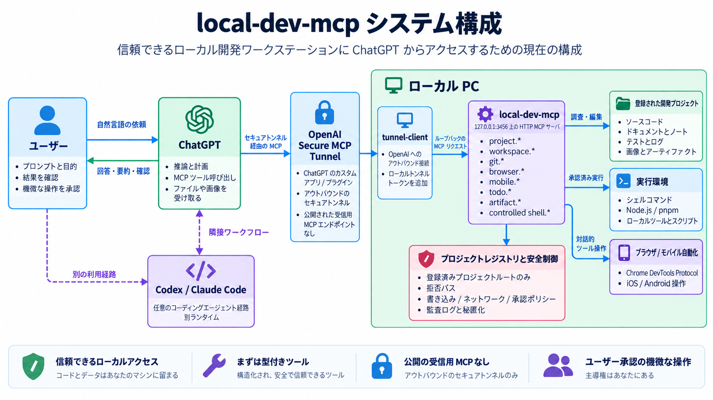

# local-dev-mcp



`local-dev-mcp` は、信頼した開発用PCを ChatGPT から操作するための private MCP server です。登録した project に対して、project / workspace / git / browser / mobile / Todo / artifact / controlled shell の typed tool を提供します。

ChatGPT との正規接続経路は **OpenAI Secure MCP Tunnel** です。HTTP MCP server は loopback のみで待ち受け、public な MCP endpoint は公開しません。

## 主な用途

- source repository の調査・編集
- test / build / deploy / custom script の実行
- browser session や mobile device の操作
- MCP inline image content による画像確認
- 開発ホストから ChatGPT への成果物受け渡し
- ChatGPT の通常添付を selected project へ受信
- conversation 単位の project 選択と audit 記録

## セキュリティモデル

主要な境界は project registry です。登録した project root だけを操作対象にします。

各 project では次を定義できます。

- host / sandbox root
- denied paths
- write policy
- approval mode
- network policy
- command timeout
- redaction profile

runtime の重要ルール:

- HTTP MCP は `127.0.0.1` のみに bind する
- HTTP request の `Host` は loopback だけを許可する
- protected HTTP request では `X-Local-Dev-MCP-Tunnel-Token` を必須にする
- HTTPのtool callとresource readはChatGPTの`openai/subject`がlocal allowlistと一致する場合だけ許可する
- local tunnel token は `tunnel-client` と `local-dev-mcp` の間だけで共有する
- Tunnel runtime API key と local tunnel token を launchd plist に埋め込まない
- `shell.run` は fallback escape hatch とし、可能な限り typed tool を優先する
- denied-path check を file read/write、artifact transfer、project-scoped operation に適用する
- artifact本体や一時 file download URL を通常のaudit logへ保存しない

stdio transport はローカルMCP client向けに残します。Secure Tunnel tokenが必要なのはHTTP transportだけです。

## ChatGPT の承認

writeやcommand executionではChatGPT側のconfirmation UIが出ることがあります。承認前にtarget projectと引数を確認してください。

MCP server側でもproject policyとshell risk policyを適用します。ChatGPT側の承認だけを安全境界にはしません。

## 機能

主要tool family:

- `project.*` — project選択・確認・reload
- `workspace.*` — boundedなlist/read/search/patch
- `git.*` — status/diff/history/commit inspection
- `shell.*` — shell実行、approval、background job、cancel
- `browser.*` — Chrome DevTools Protocol browser automation
- `mobile.*` — iOS/Android確認・操作
- `todo.*` — shared Todo Service操作
- `skills.*` — project/user/system Skillsの読み取り
- `image.read` — public URLやcustom viewerを使わないinline画像確認
- `artifact.link` — file本体をtool historyへ埋め込まず、local fileへのMCP resource linkを返す
- `artifact.read` — local fileをtool resultへ直接埋め込む互換fallback
- `artifact.receive` — ChatGPT通常添付を1回のMCP callで受信
- `tool.schema` / `tool.usage` — tool schema refreshとusage diagnostics

## 効率的な Tool 利用と Diagnostics

broadなshell commandよりtyped toolを優先します。

- active project確認はfilesystem探索ではなく`project.inspect`
- 大規模なshell scanではなくboundedな`workspace.read` / `workspace.list` / `workspace.search`
- 一般的なGit確認はtyped `git.*`
- build/test/deploy/install/未対応操作では`shell.run`
- 約30秒を超えそうな処理は`shell.run(async=true)`で開始し、`shell.status`でpoll
- server/tool変更後にChatGPT側schemaが古い場合は`tool.schema`とPlugin Refreshを使う

## Requirements

- Node.js 22以降
- Corepack経由または互換pnpm
- 付属launchd workflowを使う場合はmacOS
- ChatGPT接続にはOpenAI公式`Tunnel-client`
- browser/mobile用途では各platformの必要tool

## セットアップ

依存関係をinstallします。

```bash
pnpm install
pnpm typecheck
pnpm test
```

local project registryを設定します。通常は`config/projects.local.yaml`、未配置の場合は`config/projects.yaml`を使います。

診断:

```bash
pnpm doctor
```

local MCP clientからstdioで使う場合:

```bash
pnpm dev
```

## OpenAI Secure MCP Tunnel

### 構成

```text
ChatGPT Web / Mobile
        │
        │ custom plugin
        ▼
OpenAI Secure MCP Tunnel
        │
        ▼
tunnel-client
        │  X-Local-Dev-MCP-Tunnel-Token
        ▼
127.0.0.1:3456/mcp
        │
        ▼
local-dev-mcp
```

public MCP hostname、reverse proxy、inbound firewall ruleは不要です。

### tunnel-client install

公式latest releaseをchecksum検証してinstallします。

```bash
pnpm tunnel:install
```

既定のbinary link:

```text
~/.local-dev-mcp/bin/tunnel-client
```

releaseを明示固定する場合だけ`LOCAL_DEV_MCP_TUNNEL_CLIENT_VERSION`を指定します。

### Private state

TunnelのstateはChatGPT側の利用コンテキストごとに分離します。Personal用とBusiness用のTunnel clientは同じloopback MCP serverへ向けつつ、OpenAI control planeのstateだけを分けます。

```text
~/.local-dev-mcp/openai-tunnel-personal/
├─ organization-id
└─ tunnel-id

~/.local-dev-mcp/openai-tunnel-business/
├─ organization-id
└─ tunnel-id

~/.openai-tunnels/personal/runtime-api-key
~/.openai-tunnels/business/runtime-api-key

~/.local-dev-mcp/openai-tunnel/mcp-token
~/.local-dev-mcp/allowed-openai-subject  # optional
```

- `organization-id`: そのTunnelを所有するOpenAI organization ID
- `tunnel-id`: OpenAI Platformで作成したTunnel ID
- `runtime-api-key`: Personal / Businessそれぞれのcontrol plane用runtime key
- `mcp-token`: Tunnel clientと`local-dev-mcp`のlocal hopだけで共有するsecret。Tunnelごとには複製しません
- `allowed-openai-subject`: 任意の追加防御です。存在する場合だけ単一の匿名化ChatGPT user subject allowlistを有効化します。別subjectはfail-closedで拒否し、anonymous requestも原則拒否します。例外は[`docs/chatgpt-scheduled-task-mcp-metadata.md`](docs/chatgpt-scheduled-task-mcp-metadata.md)に記録したChatGPT Scheduled Taskのexact metadata shapeだけです。subjectを設定しない場合は必須のTunnel tokenだけで動作します

state directoryは`0700`、中のfileは`0600`を推奨します。secretやuser identifierをGitやlogへ保存しません。

automationでは次のenvironment variableも利用できます。

- `LOCAL_DEV_MCP_OPENAI_TUNNEL_ID` / `_FILE`
- `LOCAL_DEV_MCP_OPENAI_TUNNEL_ORGANIZATION_ID` / `_FILE`
- `LOCAL_DEV_MCP_OPENAI_TUNNEL_API_KEY` / `_FILE`
- `LOCAL_DEV_MCP_OPENAI_TUNNEL_TOKEN` / `_FILE`
- `LOCAL_DEV_MCP_ALLOWED_OPENAI_SUBJECT` / `_FILE`（任意。どちらかを設定するとsubject制限を有効化し、既定file `~/.local-dev-mcp/allowed-openai-subject` も存在すれば自動検出します）
- `LOCAL_DEV_MCP_OPENAI_SUBJECT_POLICY`（任意override。`enforce`はsubject設定を必須化し、`tunnel_only`はsubject制限を無効化しつつhash監査を維持します）
- `LOCAL_DEV_MCP_OPENAI_TUNNEL_STATE_DIR`
- `LOCAL_DEV_MCP_TUNNEL_CLIENT_BIN`
- `LOCAL_DEV_MCP_OPENAI_TUNNEL_HEALTH_ADDR`
- `LOCAL_DEV_MCP_OPENAI_TUNNEL_STARTUP_WAIT`
- `LOCAL_DEV_MCP_OPENAI_TUNNEL_LOG_LEVEL`

`scripts/tunnel.sh`を直接実行する場合の既定はPersonal profileです。`scripts/install-launchd.sh`はPersonal用LaunchAgentを常に生成し、Business用は次の指定で追加します。

```bash
LOCAL_DEV_MCP_OPENAI_TUNNEL_BUSINESS_ENABLE=1 scripts/install-launchd.sh --install-only
```

既定health portはPersonalが`127.0.0.1:3460`、Businessが`127.0.0.1:3462`です。

### 起動・診断

loopback HTTP MCP server:

```bash
pnpm server:http
```

server起動後にTunnel設定とMCP probeを確認:

```bash
pnpm tunnel:doctor
```

Tunnel client起動:

```bash
pnpm tunnel
```

既定:

- MCP server: `127.0.0.1:3456`
- tunnel-client health/readiness: `127.0.0.1:3460`

正常時はlocal MCP probeがreachableになり、Tunnel readinessが`ready`になります。

### launchd

plistだけ生成:

```bash
pnpm launchd:install
```

activate:

```bash
scripts/install-launchd.sh --activate
```

既定job:

```text
io.local-dev-mcp.server
io.local-dev-mcp.openai-tunnel-personal
```

`LOCAL_DEV_MCP_OPENAI_TUNNEL_BUSINESS_ENABLE=1`を付けると`io.local-dev-mcp.openai-tunnel-business`も生成します。旧`io.local-dev-mcp.openai-tunnel`と`io.local-dev-mcp.openai-tunnel-personal-mini`は廃止し、`--activate`時に停止・削除します。

serverとTunnel clientは別processなので、Tunnel reconnectでMCP serverまで再起動しません。

## ChatGPT Developer Mode で Plugin を追加する

1. OpenAI PlatformでTunnelを作る
2. Platform UIで必要な場合は利用対象のChatGPT account/workspaceへ関連付ける
3. `local-dev-mcp` と `tunnel-client` を起動してreadinessを確認する
4. ChatGPT Developer Mode / Pluginsを開く
5. connection typeに **Tunnel** を選んでcustom pluginを作る
6. Tunnel IDを選択または入力する
7. Plugin側の追加authenticationは`None`にする。private local hopはTunnel tokenで保護する
8. tool schema変更後はPluginをRefreshする

このrepositoryでは、Proのdeveloper-mode pluginを使いChatGPT WebとAndroid Mobileの両方でend-to-end確認済みです。

## 双方向ファイル転送

### 開発ホスト → ChatGPT

ユーザーへfileそのものを渡すときは、既定で`artifact.link`を使います。

```text
local file
  → artifact.link
  → MCP ResourceLink (`local-dev-artifact://...`)
  → Secure MCP Tunnel
  → 必要時だけclientが`resources/read`でoriginal fileを取得
```

`artifact.link`のtool resultにはmetadataとresource URIだけを返すため、大きなbase64 payloadを通常のtool-call履歴へ蓄積しません。original fileはclientが必要と判断した場合だけMCP `resources/read`で解決します。

`artifact.read`はembedded resourceが明示的に必要な場合の互換fallbackとして残します。こちらはfileをbase64でtool resultへ直接埋め込み、1 callあたり8 MiB上限です。

内容確認だけなら、textは`workspace.read`、画像は`image.read`を使います。

### ChatGPT → 開発ホスト

`artifact.receive` は次を宣言します。

```text
_meta["openai/fileParams"] = ["file"]
```

ChatGPTの通常添付はhost側で一時的に認可されたfile referenceへ変換されます。

```text
download_url
file_id
mime_type?
file_name?
```

`artifact.receive` は**同じ1回のMCP tool call内**でdownloadしてlocalへ保存します。base64 chunkを複数回送る必要はありません。

既定の保存仕様:

- `generated/uploads/`配下にunique fileを作る
- project-relativeな`destination`を明示可能
- 既存fileは上書きしない

受信側の保護:

- HTTPS sourceのみ
- source URLがloopback/local networkへ解決される場合は拒否
- redirect先も再検証
- project root / denied pathを適用
- destination parentのsymlink traversalを拒否
- stream中にSHA-256計算
- hard limit 512 MiB。`LOCAL_DEV_MCP_ARTIFACT_RECEIVE_MAX_BYTES`で縮小可能
- 一時download URLをaudit logへ保存しない

通常添付の受信はChatGPT WebとAndroid Mobileでend-to-end確認済みで、byte countとSHA-256が元fileと完全一致することを確認しています。

## Image Handling

`image.read` はmodelが確認できるMCP `ImageContent`とmetadataを返します。HTTP image cache、public URL、custom ChatGPT viewerは作りません。

mode:

- `preview`: 既定。対応画像が大きい場合は可能ならdownscale
- `full`: original imageをinlineで返す
- `metadata`: inline bytesなしでmetadataだけ返す

画像fileそのものをユーザーへ渡す場合は既定で`artifact.link`を使い、embedded resourceが必要な場合だけ`artifact.read`をfallbackとして使います。

## Project Registry

ChatGPTに操作を許可するrootだけを登録してください。

project entryでは少なくとも次を管理します。

- `project_id`
- display name
- host/sandbox root
- shell / timeout
- network/write/approval policy
- denied paths
- redaction profile

conversation単位の選択は`project.select`で保持します。project-sensitiveな操作でcontextが不明なら`project.current`を確認します。

## 物理モバイル端末の自動操作

mobile toolsは検出されたiOS/Android targetを操作できます。physical deviceの対応範囲はlocal toolchainとdevice stateに依存します。

macOSでは`pnpm doctor`がproject-local `agent-device`とphysical iOSのDeveloper Tools Security状態を確認します。

## Safety Notes

- private stateをregistered project root外へ置く
- local secret materialをGitへ入れない
- Tunnel state fileのpermissionを制限する
- registered projectごとのdenied-path ruleを維持する
- ChatGPT write confirmationの引数を確認する
- arbitrary shellよりtyped toolを優先する
- loopback HTTP MCP serverを別のpublic ingressへ公開しない

## Development

commit前の基本check:

```bash
pnpm typecheck
pnpm test
bash -n scripts/server.sh scripts/tunnel.sh scripts/install-launchd.sh scripts/install-openai-tunnel-client.sh
```

tool surfaceを変更したら`TOOL_SCHEMA_VERSION`を更新し、ChatGPT PluginのactionsをRefreshします。
